# Analysis of Waterloo-IV QoE Database
This repository contains code for the analysis of the *Waterloo-IV* database, demonstrating how individual QoE (Quality of Experience) 
perception significantly differs from group QoE perception. Since QoE models in the literature are constructed based on group perception, 
the results of this analysis suggest that these models could greatly benefit from personalization. This analysis represents the 
preliminary stage for the publication *Empowerment of Atypical Viewers via Low-Effort Personalized Modeling of Video Streaming Quality*.

The set-up is composed by:
 * OS: Windows 10
 * python version: 3.7
 * Microsoft Excel 365

In `requirements.txt` are listed the additional libraries needed to run the python code.

## Description
The project is organized in folders called "Figure x" where x represents the figure/figures of paper that you want to reproduce. Inside each folder further information are provided.

Part of the original [Database](https://ieee-dataport.org/open-access/waterloo-streaming-quality-experience-database-iv) is replicated in folder `Waterloo Streaming QoE Database IV`

### Waterloo-IV reference
`Zhengfang Duanmu, Wentao Liu, Zhuoran Li, Diqi Chen, Zhou Wang, Yizhou Wang, Wen Gao, September 24, 2020, "The Waterloo Streaming Quality-of-Experience Database-IV", IEEE Dataport, doi: https://dx.doi.org/10.21227/j15a-8r35.`

## Results
### Video ratings analysis
Description of analysis:

  

    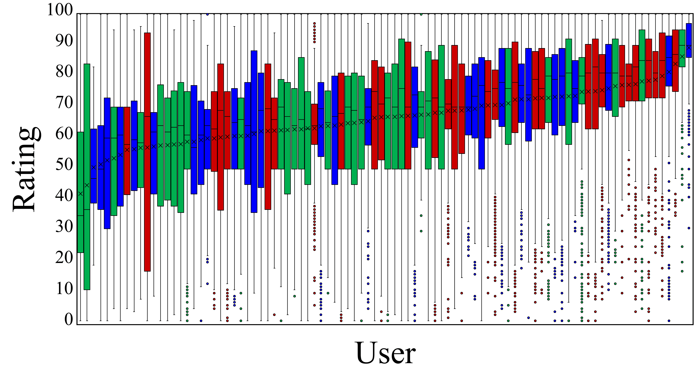
    
<em>Individual QoE perception</em>

  

  

    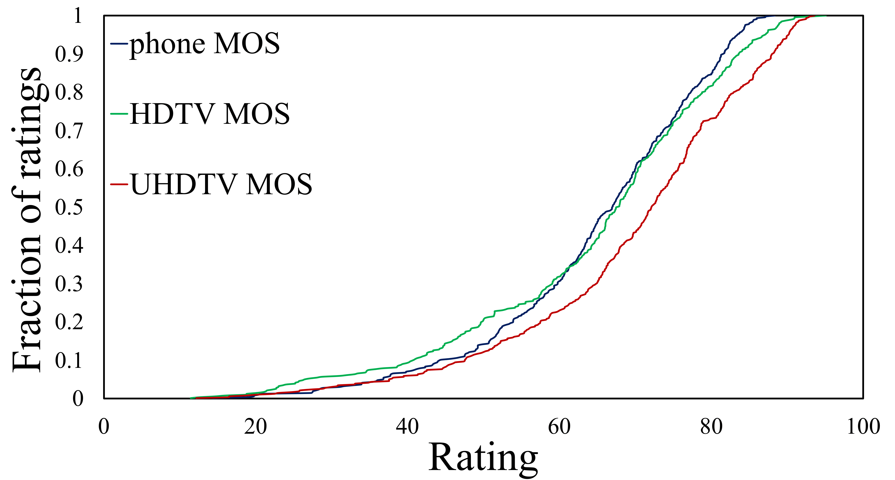
    
<em>Group QoE perception</em>

  

  

    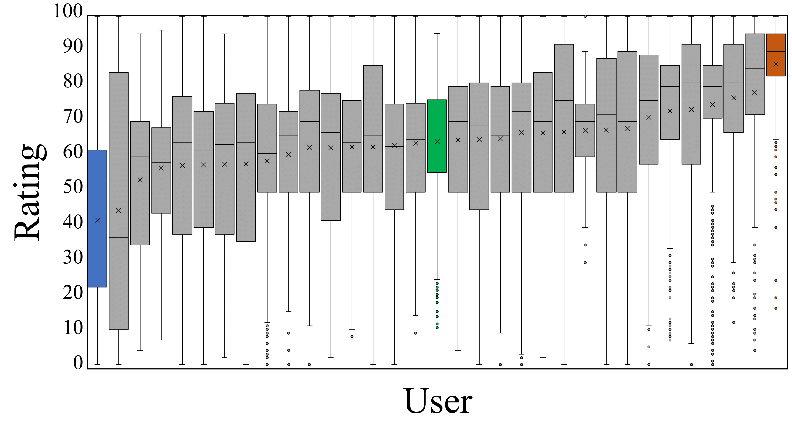
    
<em>Group QoE perception</em>

  

  <figure style="margin: 0; text-align: center;">
    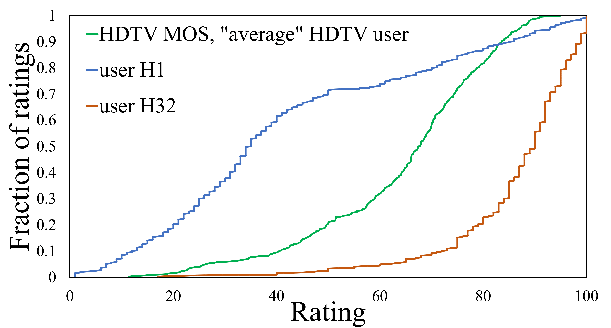
  </figure>
  <figure style="margin: 0; text-align: center;">
    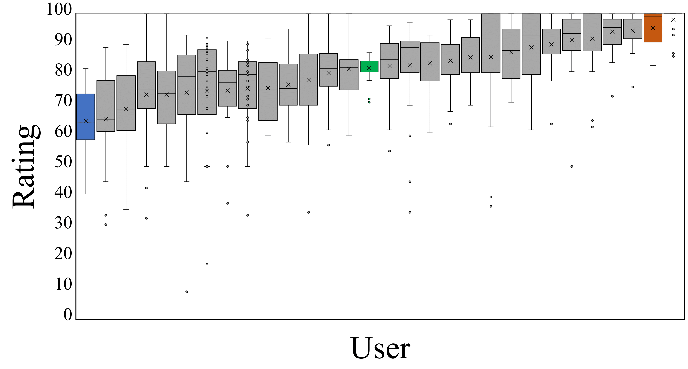
  </figure>
  <figure style="margin: 0; text-align: center;">
    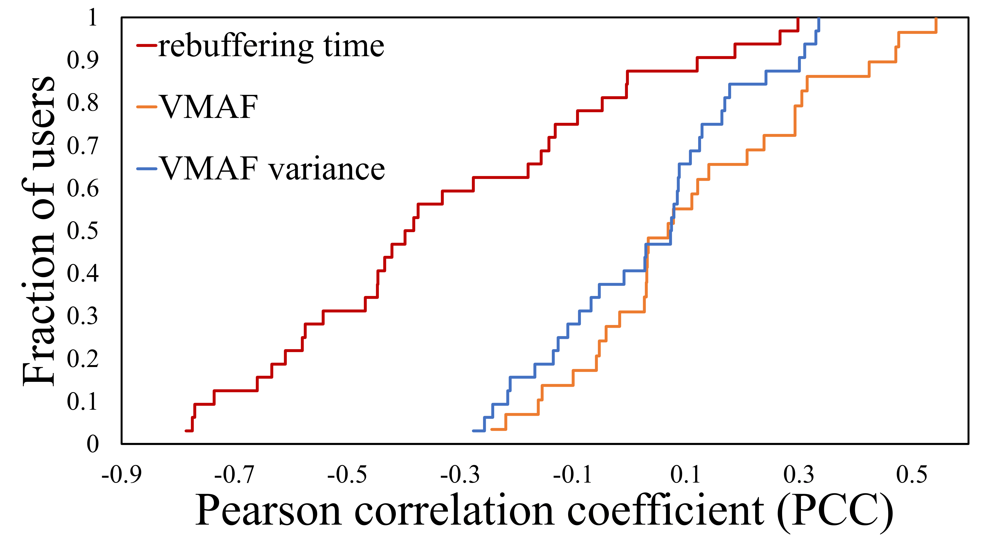
  </figure>

### Video ratings and QoE models analysis
Description of analysis:

  

  <figure style="margin: 0; text-align: center;">
    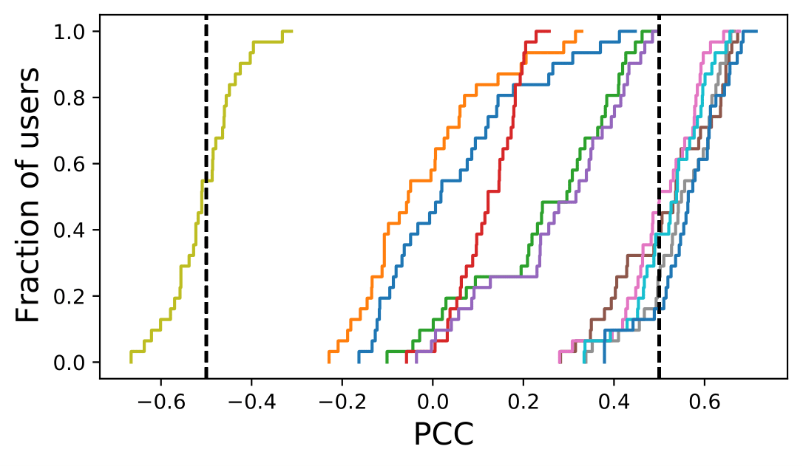
    <figcaption>Individual QoE perception</figcaption>
  </figure>
  <figure style="margin: 0; text-align: center;">
    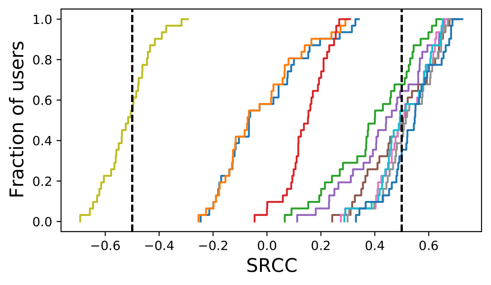
    <figcaption>Group QoE perception</figcaption>
  </figure>
  <figure style="margin: 0; text-align: center;">
    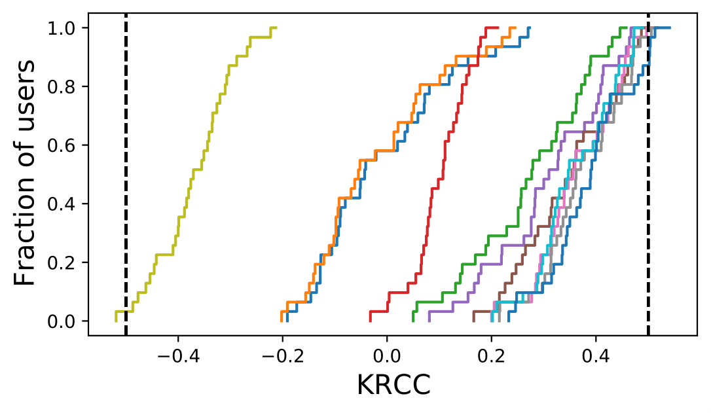
    <figcaption>Group QoE perception</figcaption>
  </figure>

  <figure style="margin: 0; text-align: center;">
    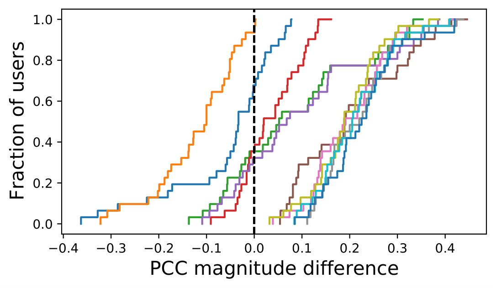
    <figcaption>Individual QoE perception</figcaption>
  </figure>
  <figure style="margin: 0; text-align: center;">
    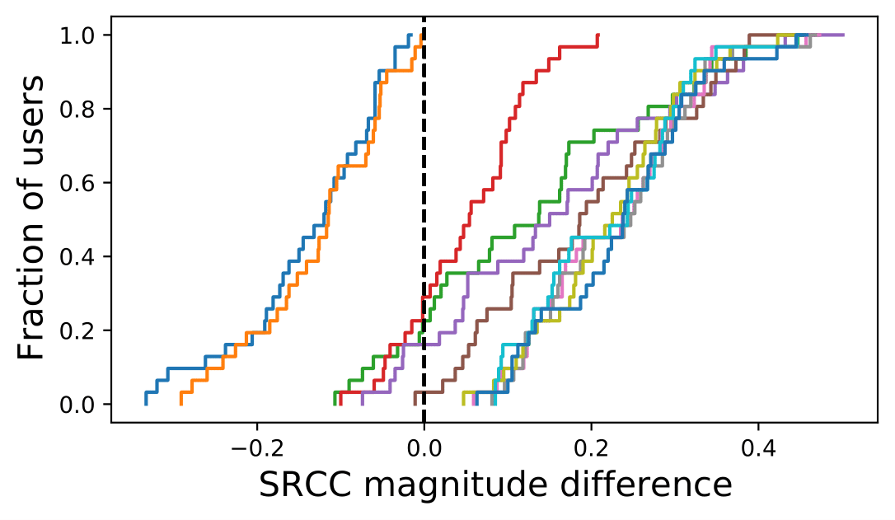
    <figcaption>Group QoE perception</figcaption>
  </figure>
  <figure style="margin: 0; text-align: center;">
    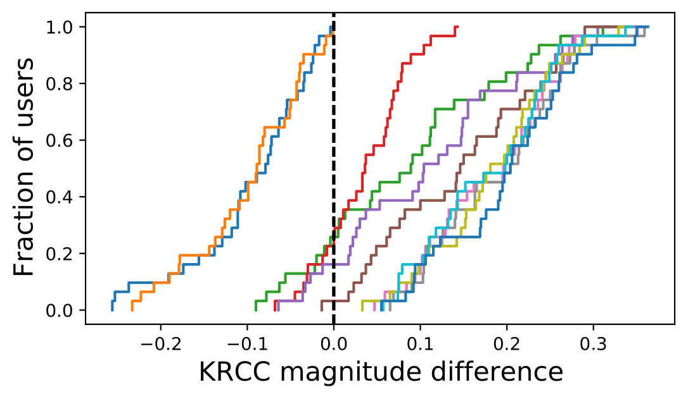
    <figcaption>Group QoE perception</figcaption>
  </figure>

### QoE model vs personalized QoE model
Description of analysis:

  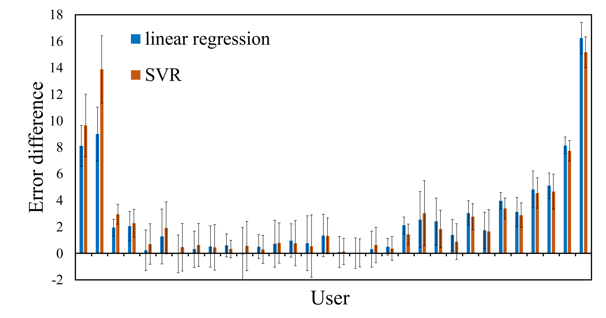
  <figcaption>Group QoE perception</figcaption>

